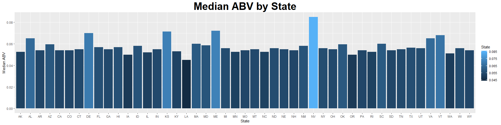
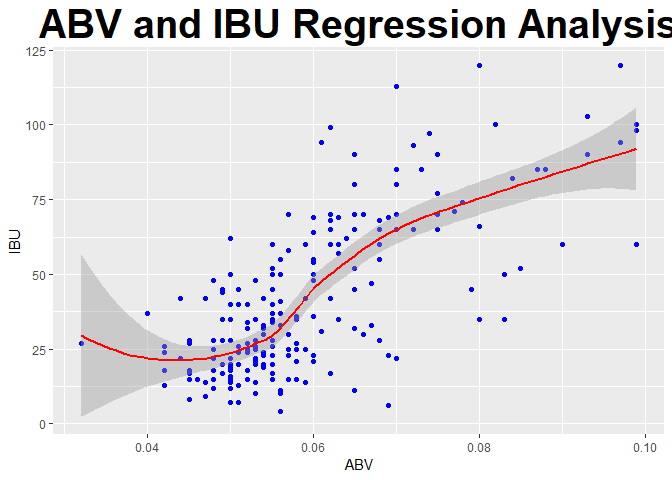

<center> <h1>Brewery Market Analysis for ExploringNewBusiness Brewery</h1> </center>
<center> <h1>Addendum</h1> </center>

Natural Intelligence Analysis Inc would like to thank ExploringNewBusiness Breweries for allowing us to provide your market analysis of current breweries in the United States. Per our meeting following the original report we have prepared the following addendum to answer your questions. The following report can be run at any time if the provided Beer and Brewery datasets are updated.


### Brewery by state

Due to your recent decision to leave your current state and move the propective location of your business we have expanded our analysis to the entire United States. A list of the number of breweries in each state provided an intial idea of the market saturation of breweries labeled as "local" in each state.


####Number of Breweries per State
<table class="table table-striped table-hover" style="margin-left: auto; margin-right: auto;">
 <thead>
  <tr>
   <th style="text-align:center;"> State </th>
   <th style="text-align:center;"> Number of Breweries </th>
  </tr>
 </thead>
<tbody>
  <tr>
   <td style="text-align:center;"> AK </td>
   <td style="text-align:center;"> 7 </td>
  </tr>
  <tr>
   <td style="text-align:center;"> AL </td>
   <td style="text-align:center;"> 3 </td>
  </tr>
  <tr>
   <td style="text-align:center;"> AR </td>
   <td style="text-align:center;"> 2 </td>
  </tr>
  <tr>
   <td style="text-align:center;"> AZ </td>
   <td style="text-align:center;"> 11 </td>
  </tr>
  <tr>
   <td style="text-align:center;"> CA </td>
   <td style="text-align:center;"> 39 </td>
  </tr>
  <tr>
   <td style="text-align:center;"> CO </td>
   <td style="text-align:center;"> 47 </td>
  </tr>
  <tr>
   <td style="text-align:center;"> CT </td>
   <td style="text-align:center;"> 8 </td>
  </tr>
  <tr>
   <td style="text-align:center;"> DC </td>
   <td style="text-align:center;"> 1 </td>
  </tr>
  <tr>
   <td style="text-align:center;"> DE </td>
   <td style="text-align:center;"> 2 </td>
  </tr>
  <tr>
   <td style="text-align:center;"> FL </td>
   <td style="text-align:center;"> 15 </td>
  </tr>
  <tr>
   <td style="text-align:center;"> GA </td>
   <td style="text-align:center;"> 7 </td>
  </tr>
  <tr>
   <td style="text-align:center;"> HI </td>
   <td style="text-align:center;"> 4 </td>
  </tr>
  <tr>
   <td style="text-align:center;"> IA </td>
   <td style="text-align:center;"> 5 </td>
  </tr>
  <tr>
   <td style="text-align:center;"> ID </td>
   <td style="text-align:center;"> 5 </td>
  </tr>
  <tr>
   <td style="text-align:center;"> IL </td>
   <td style="text-align:center;"> 18 </td>
  </tr>
  <tr>
   <td style="text-align:center;"> IN </td>
   <td style="text-align:center;"> 22 </td>
  </tr>
  <tr>
   <td style="text-align:center;"> KS </td>
   <td style="text-align:center;"> 3 </td>
  </tr>
  <tr>
   <td style="text-align:center;"> KY </td>
   <td style="text-align:center;"> 4 </td>
  </tr>
  <tr>
   <td style="text-align:center;"> LA </td>
   <td style="text-align:center;"> 5 </td>
  </tr>
  <tr>
   <td style="text-align:center;"> MA </td>
   <td style="text-align:center;"> 23 </td>
  </tr>
  <tr>
   <td style="text-align:center;"> MD </td>
   <td style="text-align:center;"> 7 </td>
  </tr>
  <tr>
   <td style="text-align:center;"> ME </td>
   <td style="text-align:center;"> 9 </td>
  </tr>
  <tr>
   <td style="text-align:center;"> MI </td>
   <td style="text-align:center;"> 32 </td>
  </tr>
  <tr>
   <td style="text-align:center;"> MN </td>
   <td style="text-align:center;"> 12 </td>
  </tr>
  <tr>
   <td style="text-align:center;"> MO </td>
   <td style="text-align:center;"> 9 </td>
  </tr>
  <tr>
   <td style="text-align:center;"> MS </td>
   <td style="text-align:center;"> 2 </td>
  </tr>
  <tr>
   <td style="text-align:center;"> MT </td>
   <td style="text-align:center;"> 9 </td>
  </tr>
  <tr>
   <td style="text-align:center;"> NC </td>
   <td style="text-align:center;"> 19 </td>
  </tr>
  <tr>
   <td style="text-align:center;"> ND </td>
   <td style="text-align:center;"> 1 </td>
  </tr>
  <tr>
   <td style="text-align:center;"> NE </td>
   <td style="text-align:center;"> 5 </td>
  </tr>
  <tr>
   <td style="text-align:center;"> NH </td>
   <td style="text-align:center;"> 3 </td>
  </tr>
  <tr>
   <td style="text-align:center;"> NJ </td>
   <td style="text-align:center;"> 3 </td>
  </tr>
  <tr>
   <td style="text-align:center;"> NM </td>
   <td style="text-align:center;"> 4 </td>
  </tr>
  <tr>
   <td style="text-align:center;"> NV </td>
   <td style="text-align:center;"> 2 </td>
  </tr>
  <tr>
   <td style="text-align:center;"> NY </td>
   <td style="text-align:center;"> 16 </td>
  </tr>
  <tr>
   <td style="text-align:center;"> OH </td>
   <td style="text-align:center;"> 15 </td>
  </tr>
  <tr>
   <td style="text-align:center;"> OK </td>
   <td style="text-align:center;"> 6 </td>
  </tr>
  <tr>
   <td style="text-align:center;"> OR </td>
   <td style="text-align:center;"> 29 </td>
  </tr>
  <tr>
   <td style="text-align:center;"> PA </td>
   <td style="text-align:center;"> 25 </td>
  </tr>
  <tr>
   <td style="text-align:center;"> RI </td>
   <td style="text-align:center;"> 5 </td>
  </tr>
  <tr>
   <td style="text-align:center;"> SC </td>
   <td style="text-align:center;"> 4 </td>
  </tr>
  <tr>
   <td style="text-align:center;"> SD </td>
   <td style="text-align:center;"> 1 </td>
  </tr>
  <tr>
   <td style="text-align:center;"> TN </td>
   <td style="text-align:center;"> 3 </td>
  </tr>
  <tr>
   <td style="text-align:center;"> TX </td>
   <td style="text-align:center;"> 28 </td>
  </tr>
  <tr>
   <td style="text-align:center;"> UT </td>
   <td style="text-align:center;"> 4 </td>
  </tr>
  <tr>
   <td style="text-align:center;"> VA </td>
   <td style="text-align:center;"> 16 </td>
  </tr>
  <tr>
   <td style="text-align:center;"> VT </td>
   <td style="text-align:center;"> 10 </td>
  </tr>
  <tr>
   <td style="text-align:center;"> WA </td>
   <td style="text-align:center;"> 23 </td>
  </tr>
  <tr>
   <td style="text-align:center;"> WI </td>
   <td style="text-align:center;"> 20 </td>
  </tr>
  <tr>
   <td style="text-align:center;"> WV </td>
   <td style="text-align:center;"> 1 </td>
  </tr>
  <tr>
   <td style="text-align:center;"> WY </td>
   <td style="text-align:center;"> 4 </td>
  </tr>
</tbody>
</table>


Further analysis of brewery location analysis in terms of brewery per capita is available upon request.
 
 


###Combination of Datasets

The following table provides a sample of the first ten and last ten Beers with their respective breweries. These tables allows you to do a quick spot check of the dataset used by the report. This is necessary in case your source data should change formats going forward. 


<table class="table table-striped table-hover" style="margin-left: auto; margin-right: auto;">
<caption>First Ten Beers of Merged DataFrame</caption>
 <thead>
  <tr>
   <th style="text-align:center;"> Beer_ID </th>
   <th style="text-align:center;"> Beer_Name </th>
   <th style="text-align:center;"> ABV </th>
   <th style="text-align:center;"> IBU </th>
   <th style="text-align:center;"> Brewery_id </th>
   <th style="text-align:center;"> Style </th>
   <th style="text-align:center;"> Ounces </th>
   <th style="text-align:center;"> Brewery_Name </th>
   <th style="text-align:center;"> City </th>
   <th style="text-align:center;"> State </th>
  </tr>
 </thead>
<tbody>
  <tr>
   <td style="text-align:center;"> 1 </td>
   <td style="text-align:center;"> Dale's Pale Ale </td>
   <td style="text-align:center;"> 0.065 </td>
   <td style="text-align:center;"> 65 </td>
   <td style="text-align:center;"> 167 </td>
   <td style="text-align:center;"> American Pale Ale (APA) </td>
   <td style="text-align:center;"> 12 </td>
   <td style="text-align:center;"> NorthGate Brewing </td>
   <td style="text-align:center;"> Minneapolis </td>
   <td style="text-align:center;"> MN </td>
  </tr>
  <tr>
   <td style="text-align:center;"> 4 </td>
   <td style="text-align:center;"> Gordon Ale (2009) </td>
   <td style="text-align:center;"> 0.087 </td>
   <td style="text-align:center;"> 85 </td>
   <td style="text-align:center;"> 167 </td>
   <td style="text-align:center;"> American Double / Imperial IPA </td>
   <td style="text-align:center;"> 12 </td>
   <td style="text-align:center;"> Mike Hess Brewing Company </td>
   <td style="text-align:center;"> San Diego </td>
   <td style="text-align:center;"> CA </td>
  </tr>
  <tr>
   <td style="text-align:center;"> 5 </td>
   <td style="text-align:center;"> Old Chub </td>
   <td style="text-align:center;"> 0.080 </td>
   <td style="text-align:center;"> 35 </td>
   <td style="text-align:center;"> 167 </td>
   <td style="text-align:center;"> Scottish Ale </td>
   <td style="text-align:center;"> 12 </td>
   <td style="text-align:center;"> Fort Point Beer Company </td>
   <td style="text-align:center;"> San Francisco </td>
   <td style="text-align:center;"> CA </td>
  </tr>
  <tr>
   <td style="text-align:center;"> 6 </td>
   <td style="text-align:center;"> GUBNA Imperial IPA </td>
   <td style="text-align:center;"> 0.099 </td>
   <td style="text-align:center;"> 100 </td>
   <td style="text-align:center;"> 167 </td>
   <td style="text-align:center;"> American Double / Imperial IPA </td>
   <td style="text-align:center;"> 12 </td>
   <td style="text-align:center;"> COAST Brewing Company </td>
   <td style="text-align:center;"> Charleston </td>
   <td style="text-align:center;"> SC </td>
  </tr>
  <tr>
   <td style="text-align:center;"> 7 </td>
   <td style="text-align:center;"> Mama's Little Yella Pils </td>
   <td style="text-align:center;"> 0.053 </td>
   <td style="text-align:center;"> 35 </td>
   <td style="text-align:center;"> 167 </td>
   <td style="text-align:center;"> Czech Pilsener </td>
   <td style="text-align:center;"> 12 </td>
   <td style="text-align:center;"> Great Divide Brewing Company </td>
   <td style="text-align:center;"> Denver </td>
   <td style="text-align:center;"> CO </td>
  </tr>
  <tr>
   <td style="text-align:center;"> 8 </td>
   <td style="text-align:center;"> Ten Fidy Imperial Stout </td>
   <td style="text-align:center;"> 0.099 </td>
   <td style="text-align:center;"> 98 </td>
   <td style="text-align:center;"> 167 </td>
   <td style="text-align:center;"> Russian Imperial Stout </td>
   <td style="text-align:center;"> 12 </td>
   <td style="text-align:center;"> Tapistry Brewing </td>
   <td style="text-align:center;"> Bridgman </td>
   <td style="text-align:center;"> MI </td>
  </tr>
  <tr>
   <td style="text-align:center;"> 9 </td>
   <td style="text-align:center;"> Hell or High Watermelon Wheat </td>
   <td style="text-align:center;"> 0.049 </td>
   <td style="text-align:center;"> 17 </td>
   <td style="text-align:center;"> 369 </td>
   <td style="text-align:center;"> Fruit / Vegetable Beer </td>
   <td style="text-align:center;"> 12 </td>
   <td style="text-align:center;"> Big Lake Brewing </td>
   <td style="text-align:center;"> Holland </td>
   <td style="text-align:center;"> MI </td>
  </tr>
  <tr>
   <td style="text-align:center;"> 10 </td>
   <td style="text-align:center;"> Brew Free! or Die IPA </td>
   <td style="text-align:center;"> 0.070 </td>
   <td style="text-align:center;"> 65 </td>
   <td style="text-align:center;"> 369 </td>
   <td style="text-align:center;"> American IPA </td>
   <td style="text-align:center;"> 12 </td>
   <td style="text-align:center;"> The Mitten Brewing Company </td>
   <td style="text-align:center;"> Grand Rapids </td>
   <td style="text-align:center;"> MI </td>
  </tr>
  <tr>
   <td style="text-align:center;"> 11 </td>
   <td style="text-align:center;"> Monk's Blood </td>
   <td style="text-align:center;"> 0.083 </td>
   <td style="text-align:center;"> 35 </td>
   <td style="text-align:center;"> 369 </td>
   <td style="text-align:center;"> Belgian Dark Ale </td>
   <td style="text-align:center;"> 12 </td>
   <td style="text-align:center;"> Brewery Vivant </td>
   <td style="text-align:center;"> Grand Rapids </td>
   <td style="text-align:center;"> MI </td>
  </tr>
  <tr>
   <td style="text-align:center;"> 12 </td>
   <td style="text-align:center;"> Furious </td>
   <td style="text-align:center;"> 0.062 </td>
   <td style="text-align:center;"> 99 </td>
   <td style="text-align:center;"> 62 </td>
   <td style="text-align:center;"> American IPA </td>
   <td style="text-align:center;"> 16 </td>
   <td style="text-align:center;"> Petoskey Brewing </td>
   <td style="text-align:center;"> Petoskey </td>
   <td style="text-align:center;"> MI </td>
  </tr>
</tbody>
</table>

<table class="table table-striped table-hover" style="margin-left: auto; margin-right: auto;">
<caption>Last Ten Beers of Merged DataFrame</caption>
 <thead>
  <tr>
   <th style="text-align:left;">   </th>
   <th style="text-align:center;"> Beer_ID </th>
   <th style="text-align:center;"> Beer_Name </th>
   <th style="text-align:center;"> ABV </th>
   <th style="text-align:center;"> IBU </th>
   <th style="text-align:center;"> Brewery_id </th>
   <th style="text-align:center;"> Style </th>
   <th style="text-align:center;"> Ounces </th>
   <th style="text-align:center;"> Brewery_Name </th>
   <th style="text-align:center;"> City </th>
   <th style="text-align:center;"> State </th>
  </tr>
 </thead>
<tbody>
  <tr>
   <td style="text-align:left;"> 368 </td>
   <td style="text-align:center;"> 546 </td>
   <td style="text-align:center;"> Jai Alai IPA </td>
   <td style="text-align:center;"> 0.075 </td>
   <td style="text-align:center;"> 70 </td>
   <td style="text-align:center;"> 142 </td>
   <td style="text-align:center;"> American IPA </td>
   <td style="text-align:center;"> 12 </td>
   <td style="text-align:center;"> Lancaster Brewing Company </td>
   <td style="text-align:center;"> Lancaster </td>
   <td style="text-align:center;"> PA </td>
  </tr>
  <tr>
   <td style="text-align:left;"> 369 </td>
   <td style="text-align:center;"> 547 </td>
   <td style="text-align:center;"> La Perouse White </td>
   <td style="text-align:center;"> 0.050 </td>
   <td style="text-align:center;"> 12 </td>
   <td style="text-align:center;"> 376 </td>
   <td style="text-align:center;"> Witbier </td>
   <td style="text-align:center;"> 12 </td>
   <td style="text-align:center;"> Upstate Brewing Company </td>
   <td style="text-align:center;"> Elmira </td>
   <td style="text-align:center;"> NY </td>
  </tr>
  <tr>
   <td style="text-align:left;"> 370 </td>
   <td style="text-align:center;"> 548 </td>
   <td style="text-align:center;"> Golden Road Hefeweizen (2012) </td>
   <td style="text-align:center;"> 0.046 </td>
   <td style="text-align:center;"> 15 </td>
   <td style="text-align:center;"> 241 </td>
   <td style="text-align:center;"> Hefeweizen </td>
   <td style="text-align:center;"> 16 </td>
   <td style="text-align:center;"> Moat Mountain Smoke House &amp; Brew... </td>
   <td style="text-align:center;"> North Conway </td>
   <td style="text-align:center;"> NH </td>
  </tr>
  <tr>
   <td style="text-align:left;"> 371 </td>
   <td style="text-align:center;"> 549 </td>
   <td style="text-align:center;"> Point the Way IPA (2012) </td>
   <td style="text-align:center;"> 0.059 </td>
   <td style="text-align:center;"> 60 </td>
   <td style="text-align:center;"> 241 </td>
   <td style="text-align:center;"> American IPA </td>
   <td style="text-align:center;"> 16 </td>
   <td style="text-align:center;"> Prescott Brewing Company </td>
   <td style="text-align:center;"> Prescott </td>
   <td style="text-align:center;"> AZ </td>
  </tr>
  <tr>
   <td style="text-align:left;"> 372 </td>
   <td style="text-align:center;"> 550 </td>
   <td style="text-align:center;"> Rocket Girl </td>
   <td style="text-align:center;"> 0.032 </td>
   <td style="text-align:center;"> 27 </td>
   <td style="text-align:center;"> 529 </td>
   <td style="text-align:center;"> Kölsch </td>
   <td style="text-align:center;"> 12 </td>
   <td style="text-align:center;"> Mogollon Brewing Company </td>
   <td style="text-align:center;"> Flagstaff </td>
   <td style="text-align:center;"> AZ </td>
  </tr>
  <tr>
   <td style="text-align:left;"> 373 </td>
   <td style="text-align:center;"> 552 </td>
   <td style="text-align:center;"> Cavatica Stout </td>
   <td style="text-align:center;"> 0.088 </td>
   <td style="text-align:center;"> NA </td>
   <td style="text-align:center;"> 207 </td>
   <td style="text-align:center;"> American Double / Imperial Stout </td>
   <td style="text-align:center;"> 16 </td>
   <td style="text-align:center;"> Silverton Brewery </td>
   <td style="text-align:center;"> Silverton </td>
   <td style="text-align:center;"> CO </td>
  </tr>
  <tr>
   <td style="text-align:left;"> 374 </td>
   <td style="text-align:center;"> 553 </td>
   <td style="text-align:center;"> People's Pale Ale </td>
   <td style="text-align:center;"> 0.053 </td>
   <td style="text-align:center;"> 28 </td>
   <td style="text-align:center;"> 528 </td>
   <td style="text-align:center;"> American Pale Ale (APA) </td>
   <td style="text-align:center;"> 12 </td>
   <td style="text-align:center;"> Mickey Finn's Brewery </td>
   <td style="text-align:center;"> Libertyville </td>
   <td style="text-align:center;"> IL </td>
  </tr>
  <tr>
   <td style="text-align:left;"> 375 </td>
   <td style="text-align:center;"> 555 </td>
   <td style="text-align:center;"> Le Mort Vivant (2011) </td>
   <td style="text-align:center;"> 0.069 </td>
   <td style="text-align:center;"> 23 </td>
   <td style="text-align:center;"> 119 </td>
   <td style="text-align:center;"> Bière de Garde </td>
   <td style="text-align:center;"> 12 </td>
   <td style="text-align:center;"> Dave's Brewfarm </td>
   <td style="text-align:center;"> Wilson </td>
   <td style="text-align:center;"> WI </td>
  </tr>
  <tr>
   <td style="text-align:left;"> 376 </td>
   <td style="text-align:center;"> 556 </td>
   <td style="text-align:center;"> Eclipse Black IPA </td>
   <td style="text-align:center;"> 0.077 </td>
   <td style="text-align:center;"> 71 </td>
   <td style="text-align:center;"> 516 </td>
   <td style="text-align:center;"> American Black Ale </td>
   <td style="text-align:center;"> 16 </td>
   <td style="text-align:center;"> Ukiah Brewing Company </td>
   <td style="text-align:center;"> Ukiah </td>
   <td style="text-align:center;"> CA </td>
  </tr>
  <tr>
   <td style="text-align:left;"> 377 </td>
   <td style="text-align:center;"> 558 </td>
   <td style="text-align:center;"> I-10 IPA </td>
   <td style="text-align:center;"> 0.068 </td>
   <td style="text-align:center;"> 55 </td>
   <td style="text-align:center;"> 528 </td>
   <td style="text-align:center;"> American IPA </td>
   <td style="text-align:center;"> 12 </td>
   <td style="text-align:center;"> Sleeping Lady Brewing Company </td>
   <td style="text-align:center;"> Anchorage </td>
   <td style="text-align:center;"> AK </td>
  </tr>
</tbody>
</table>


###Missing Values

We have noticed that the available data does include a number of missing values. We have provided a table to allow for line of site of the count of missing data per column. We highly recommend your marketing team continue to add to your beer and brewery initial market research data sets until the table shows all 0's to allow for the provided report to be increasingly accurate.


<table class="table table-striped table-hover" style="margin-left: auto; margin-right: auto;">
 <thead>
  <tr>
   <th style="text-align:left;"> ColumnName </th>
   <th style="text-align:right;"> Missing Values </th>
  </tr>
 </thead>
<tbody>
  <tr>
   <td style="text-align:left;"> Beer_ID </td>
   <td style="text-align:right;"> 0 </td>
  </tr>
  <tr>
   <td style="text-align:left;"> Beer_Name </td>
   <td style="text-align:right;"> 0 </td>
  </tr>
  <tr>
   <td style="text-align:left;"> ABV </td>
   <td style="text-align:right;"> 22 </td>
  </tr>
  <tr>
   <td style="text-align:left;"> IBU </td>
   <td style="text-align:right;"> 146 </td>
  </tr>
  <tr>
   <td style="text-align:left;"> Brewery_id </td>
   <td style="text-align:right;"> 0 </td>
  </tr>
  <tr>
   <td style="text-align:left;"> Style </td>
   <td style="text-align:right;"> 0 </td>
  </tr>
  <tr>
   <td style="text-align:left;"> Ounces </td>
   <td style="text-align:right;"> 0 </td>
  </tr>
  <tr>
   <td style="text-align:left;"> Brewery_Name </td>
   <td style="text-align:right;"> 0 </td>
  </tr>
  <tr>
   <td style="text-align:left;"> City </td>
   <td style="text-align:right;"> 0 </td>
  </tr>
  <tr>
   <td style="text-align:left;"> State </td>
   <td style="text-align:right;"> 0 </td>
  </tr>
</tbody>
</table>


###Beer Characteristics by State -- ABV and IBU

We understood your concern about differing tastes in beer style regarding Alcohol by Volume(ABV) and Bitterness(IBV).A median value for ABV and IBV by state provides a quick reference point until a more in depth analysis can be completed. 

*If any state has no reported Beers a relevant message will be produced before the graph.*

```
## Warning: Removed 1 rows containing missing values (position_stack).
```

<!-- --><!-- -->


A snapshot of the current beer with the highest ABV and IBU will allow you to ensure that your "Jupiter IPA" beer can still be marketed as the "highest alcohol IPA with the a punch of Hops to the face".


####Beer with Highest ABV
<table class="table table-striped table-hover" style="margin-left: auto; margin-right: auto;">
 <thead>
  <tr>
   <th style="text-align:left;">   </th>
   <th style="text-align:right;"> Beer_ID </th>
   <th style="text-align:left;"> Beer_Name </th>
   <th style="text-align:right;"> ABV </th>
   <th style="text-align:right;"> IBU </th>
   <th style="text-align:right;"> Brewery_id </th>
   <th style="text-align:left;"> Style </th>
   <th style="text-align:right;"> Ounces </th>
   <th style="text-align:left;"> Brewery_Name </th>
   <th style="text-align:left;"> City </th>
   <th style="text-align:left;"> State </th>
  </tr>
 </thead>
<tbody>
  <tr>
   <td style="text-align:left;"> 4 </td>
   <td style="text-align:right;"> 6 </td>
   <td style="text-align:left;"> GUBNA Imperial IPA </td>
   <td style="text-align:right;"> 0.099 </td>
   <td style="text-align:right;"> 100 </td>
   <td style="text-align:right;"> 167 </td>
   <td style="text-align:left;"> American Double / Imperial IPA </td>
   <td style="text-align:right;"> 12 </td>
   <td style="text-align:left;"> COAST Brewing Company </td>
   <td style="text-align:left;"> Charleston </td>
   <td style="text-align:left;"> SC </td>
  </tr>
</tbody>
</table>

####Beer with Highest IBV
<table class="table table-striped table-hover" style="margin-left: auto; margin-right: auto;">
 <thead>
  <tr>
   <th style="text-align:left;">   </th>
   <th style="text-align:right;"> Beer_ID </th>
   <th style="text-align:left;"> Beer_Name </th>
   <th style="text-align:right;"> ABV </th>
   <th style="text-align:right;"> IBU </th>
   <th style="text-align:right;"> Brewery_id </th>
   <th style="text-align:left;"> Style </th>
   <th style="text-align:right;"> Ounces </th>
   <th style="text-align:left;"> Brewery_Name </th>
   <th style="text-align:left;"> City </th>
   <th style="text-align:left;"> State </th>
  </tr>
 </thead>
<tbody>
  <tr>
   <td style="text-align:left;"> 13 </td>
   <td style="text-align:right;"> 15 </td>
   <td style="text-align:left;"> Abrasive Ale </td>
   <td style="text-align:right;"> 0.097 </td>
   <td style="text-align:right;"> 120 </td>
   <td style="text-align:right;"> 62 </td>
   <td style="text-align:left;"> American Double / Imperial IPA </td>
   <td style="text-align:right;"> 16 </td>
   <td style="text-align:left;"> Witch's Hat Brewing Company </td>
   <td style="text-align:left;"> South Lyon </td>
   <td style="text-align:left;"> MI </td>
  </tr>
</tbody>
</table>


Jupiter IPA should also be compared to the current national ABV in general.


####National ABV Statistics
<table class="table table-striped table-hover" style="margin-left: auto; margin-right: auto;">
 <thead>
  <tr>
   <th style="text-align:left;"> Min. </th>
   <th style="text-align:left;"> 1st Qu. </th>
   <th style="text-align:left;"> Median </th>
   <th style="text-align:left;"> Mean </th>
   <th style="text-align:left;"> 3rd Qu. </th>
   <th style="text-align:left;"> Max. </th>
   <th style="text-align:left;"> NA's </th>
  </tr>
 </thead>
<tbody>
  <tr>
   <td style="text-align:left;"> 0.032 </td>
   <td style="text-align:left;"> 0.05 </td>
   <td style="text-align:left;"> 0.055 </td>
   <td style="text-align:left;"> 0.0583154929577465 </td>
   <td style="text-align:left;"> 0.065 </td>
   <td style="text-align:left;"> 0.099 </td>
   <td style="text-align:left;"> 22 </td>
  </tr>
</tbody>
</table>


###Relationship of ABV to IBU

We understand your concern that further increase to the ABV of Jupiter IPA will negatively affect the beer's IBU. The data currently shows no need for such a concern. In fact the IBU seems to increase with ABV. Although the relationship is not very strong. Whether the ABV is causing the increase in the IBU or tastes in high ABV coincide with tasts in high IBU warrants further research by R&D.


```
## `geom_smooth()` using method = 'loess' and formula 'y ~ x'
```

```
## Warning: Removed 146 rows containing non-finite values (stat_smooth).
```

```
## Warning: Removed 146 rows containing missing values (geom_point).
```

<!-- -->
